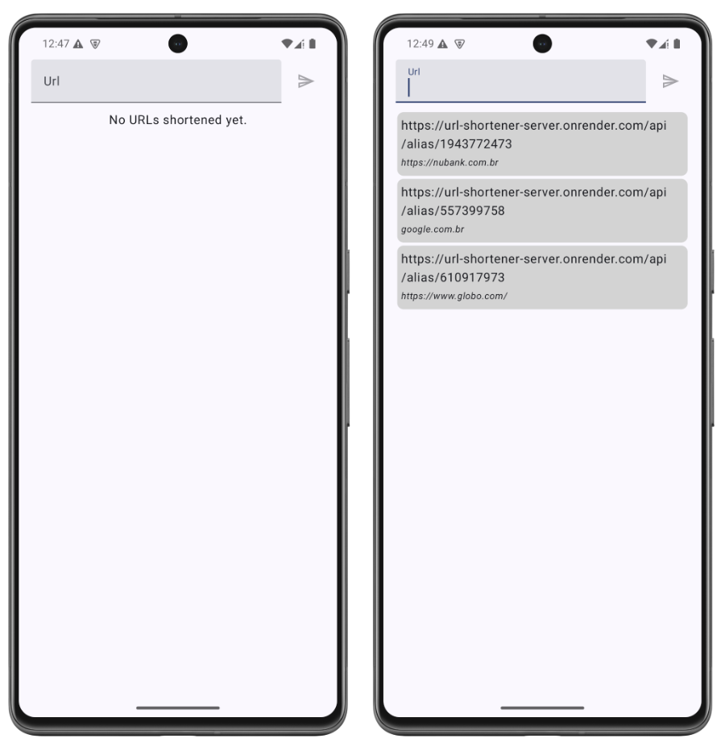

# URL Shortener Android App

A simple URL shortener app built with Jetpack Compose and Kotlin.



## Features

- Convert long URLs into short
- View and manage previously shortened URLs

## Tech Stack

- **Kotlin 2.2** + **Jetpack Compose BOM 2025.06.01**
- **MVI Architecture** with StateFlow
- **Retrofit 3.0** for networking with OkHttp 4
- **Dagger Hilt 2.56** for dependency injection
- **Detekt** for code analysis
- **Android Gradle Plugin 8.11** with Gradle 8.14

## Getting Started

### Requirements
- Android Studio Narwhal (2025.1.1) or newer
- JDK 17+
- Android SDK 36 (API level 36)
- Gradle 8.14 or newer

### Build & Run
```bash
# Run tests
./gradlew test

# Build debug APK
./gradlew assembleDebug

# Build release APK
./gradlew assembleRelease

# Code analysis
./gradlew detekt

# Android lint analysis
./gradlew lint

# Full build with all checks
./gradlew build
```

## Code Quality

This project maintains high code quality standards:

- ✅ **Zero lint warnings** - All Android lint issues resolved
- ✅ **Detekt analysis** - Kotlin code style and quality checks
- ✅ **Unit tests** - Comprehensive test coverage
- ✅ **Latest dependencies** - All libraries updated to stable versions
